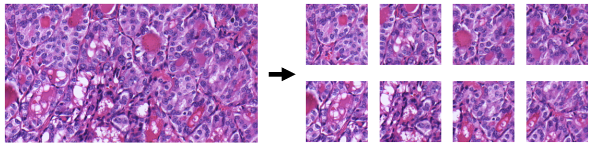
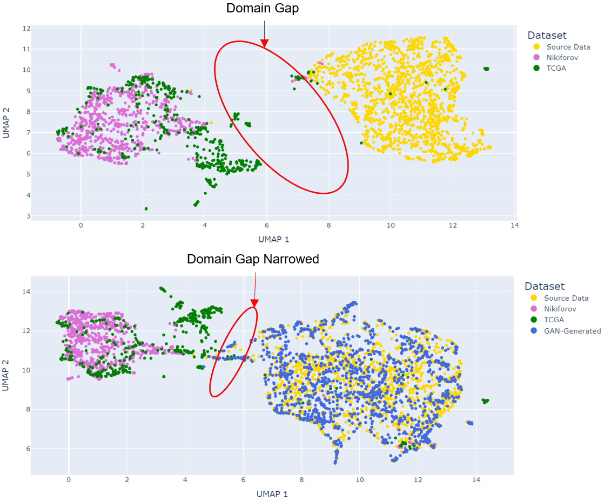

# Thy-GAN 
## Can GAN-Generated Images Help Bridge the Domain Gap between Thyroid Histopathology Image Datasets?

<p align="center">

</p>
  
Abstract: *TBC*

## Primary Reference Material and Data Sources

| Path | Description
| :--- | :----------
| [Böhland et al. (2021)](https://www.ncbi.nlm.nih.gov/pmc/articles/PMC8457451/) |  Reference Paper (Based on Tharun Thompson Dataset)
| [Nikiforov Data](http://image.upmc.edu:8080/NikiForov%20EFV%20Study/BoxA/view.apml?listview=1) |  Source of Nikiforov External Dataset Samples
| [TCGA-THCA Data](https://portal.gdc.cancer.gov/projects/TCGA-THCA) |  Source of TCGA External Dataset Samples
| [StyleGAN2-ADA Pytorch](https://github.com/NVlabs/stylegan2-ada-pytorch) | StyleGAN2-ADA Github Repository
| &ensp;&ensp;&boxvr;&nbsp; [styleGAN2-ada.pdf](https://nvlabs-fi-cdn.nvidia.com/stylegan2-ada-pytorch/ada-paper.pdf) | StyleGAN2-ADA Research Paper

## Requirements


## Getting Started

The original images in the Tharun Thompson dataset are 1916x1053 pixels. StyleGAN2-ADA's dataset_tool.py automatically crops 512x512 images from the center of the source dataset. 

If the source data is larger than 512x512, to ensure all data is being used to train the GAN, the images can initially be split using [split_dataset.py](./split_dataset.py) as follows:

```.bash
# Split source data into 512x512 crops:
python split_dataset.py --source data_dir --labels data_labels --dest out_dir --crop_size 512
```


After zipping the resulting image files and dataset.json labels file, this zip file can be further pre-processed by StyleGAN2's [dataset_tool.py](https://github.com/NVlabs/stylegan2-ada-pytorch/blob/main/dataset_tool.py). Then the data is ready for GAN training.

```.bash
# Perpare images for StyleGAN2-ADA Generative Adversarial Network Training:
python dataset_tool.py --source data_dir/split_data.zip --dest out_dir --transform center-crop \
--width 512 --height 512
```

## StyleGAN2-ADA Generative Adversarial Network

The StyleGAN2-ADA repository should be downloaded. This work utilizes the [official PyTorch implementation](https://github.com/NVlabs/stylegan2-ada-pytorch).

### Training

The GAN was trained with the following arguments:
  - `--cfg = paper512` to mirror the parameter settings used for the BRECAHAD dataset - a small dataset containing breast cancer histopathology images (see StyleGAN2-ADA paper for more detail). 
  - `--cond = 1` ensures the GAN is trained using the labels provided, and so is subsequently able to produce images for a given class.
  - `--mirror = 1` includes x-flips of each image in the dataset, effectively doubling the training images.
  - `--kimg = 25000` sets the GAN to train based on 25 million real/generated images.

```.bash
# Run StyleGAN2-ADA GAN Training:
python train.py --outdir=outdir --data=dataset_tool_output.zip --gpus=4 --cfg=paper512 \
  --cond=1 --mirror=1 --kimg=25000
```

Shell script files used to run the GAN training on the Queen Mary HPC are included in the [shell_scr](.shell_scr/) directory.

### Image Generation

Once the GAN has been trained and the checkpoint with the lowest FID score has been saved, the [generate.py](https://github.com/NVlabs/stylegan2-ada/blob/main/generate.py) from the StyleGAN2 repository can be used to generate fake images. The seeds ensure that the same images can be reproduced from the network if required.

```.bash
# Generate 200 fake images for specified class label 
# In this example, the class selected was indexed as 0 during training
python generate.py --outdir=outdir --seeds=0-200 --network=models/network.pkl --class=0
```

## Domain Gap Visualization

The domain gap between the Tharun and Thompson dataset and the external data from Nikiforov and TCGA has been visualized by passing the images through [ResNet50](https://arxiv.org/abs/1512.03385) before using Uniform Manifold Approximation and Projection ([UMAP](https://umap-learn.readthedocs.io/en/latest/)), an unsupervised dimensionality reduction technique, to reduce the 2,048-long ResNet50 vectors down to two dimensions for plotting. 

1,500 synthetic GAN-generated images (750 PTC-like and 750 Non-PTC-like) were then generated using the [generate.py](https://github.com/NVlabs/stylegan2-ada/blob/main/generate.py) function to visualize how their inclusion changed the domain gap between datasets.



The notebook used to process the images and visualize the domain gap is included at [DG_Visualization.ipynb](./notebooks/DG_Visualization.ipynb).

## Deep Learning Classifier

This repository contains the modules needed to replicate the deep learning classifier, trained to identify thyroid histopathology images as PTC-like or Non-PTC-like.

### Training


```.bash
# Train DLC based on the first cross-validation split using no GAN images
python dlc_main.py --src_dir=data/TharunThompson/ --labels=data/bi_dataset.json --out_dir=logs/ --lrd_epc=10 --lrd_fac=0.5 --es_pat=50 \
  --split_file=data/cv_splits/cv0_split.json --run_id='cv0' --batch_size=64 --lr=1e-3 --gan_params=None

# Augment the training data by increasing the majority class by 100% and then equalizing the no. minority classes ("MC100")
python dlc_main.py --src_dir=data/TharunThompson/ --labels=data/bi_dataset.json --out_dir=logs/ --lrd_epc=10 --lrd_fac=0.5 --es_pat=50 \
  --split_file=data/cv_splits/cv0_split.json --run_id='cv0' --batch_size=64 --lr=1e-3 --gan_params=data/gan_params/cv_mc100.json
```
